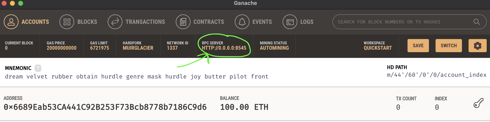
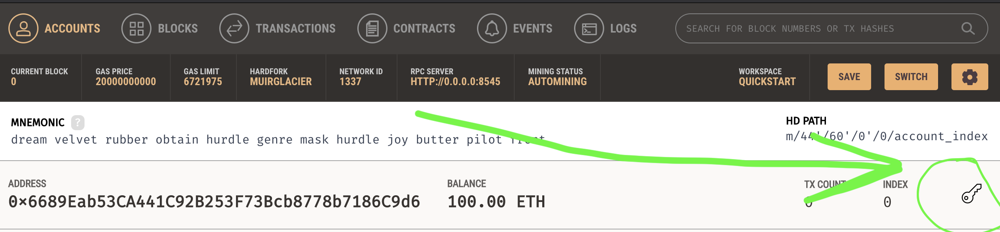
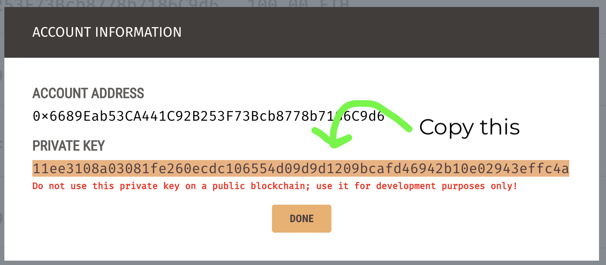

# Getting Started

## Requirements

- [git](https://git-scm.com/book/en/v2/Getting-Started-Installing-Git)
  - You'll know you did it right if you can run `git --version` and you see a response like `git version x.x.x`
- [Nodejs](https://nodejs.org/en/)
  - You'll know you've installed nodejs right if you can run:
    - `node --version` and get an ouput like: `vx.x.x`
- [Yarn](https://classic.yarnpkg.com/lang/en/docs/install/) instead of `npm`
  - You'll know you've installed yarn right if you can run:
    - `yarn --version` and get an output like: `x.x.x`
    - You might need to install it with npm
- [ganache](https://trufflesuite.com/ganache/)
  - You'll know you did it right if you can run the application and see:
    <br>
    
  - You can alternatively use [ganache-cli](https://www.npmjs.com/package/ganache-cli) or [hardhat](https://hardhat.org/)

## Setup

Clone this repo

```
git clone https://github.com/Tonashiro/blockchain-solidity-course.git
cd ethers-simple-storage
```

Then install dependencies

```
yarn
```

## Usage

1. Run your ganache local chain, by hitting `quickstart` on your ganache application

2. Copy the `RPC SERVER` sting in your ganache CLI, and place it into your `.env` file.



`.env` Example:

```
RPC_URL=http://0.0.0.0:8545
```

3. Hit the key on one of the accounts, and copy the key you see and place it into your `.env` file.





`.env` Example:

PRIVATE_KEY=11ee3108a03081fe260ecdc106554d09d9d1209bcafd46942b10e02943effc4a

4. Compile your code

Run

```
yarn compile
```

You'll see files `SimpleStorage_sol_SimpleStorage.abi` and `SimpleStorage_sol_SimpleStorage.bin` be created.

5. Run your application

```
node deploy.js
```
### For WSL users

1. Run
```
yarn add ganache
```

2. Change Server settings in Ganache

Settings > Server > Host Name 

Change Host Name to vEthernet (WSL)

3. Run your application 

``` 
node deploy.js
```
